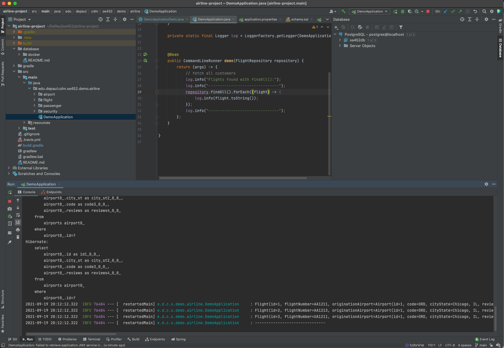

# airline-project

# Installing Database.
Setup of Docker Compose database to support demo, whether project or for concept. 
Go to the database directory and run the docker command to create the database.

## Tools

| Tool | Used for
| ----------- | ----------- 
| [Docker](https://www.docker.com/products/docker-desktop) | Containerization to ease database setup

### Docker commands
<li>start: docker-compose up -d
<li>stop: docker-compose down
 <i><b>Need to create database first time</b></i><li>docker exec -it demo-postgres psql -Upostgres<li>create database se452db;</li>

# Steven La

**Project scope area**

**Initial key features**

**Github location**
* https://github.com/se452-group3/airline-project

**How conflicts will be resolved**
* Pull request will be created for each commits and will require one review approval to be able to merge to main branch

**Communication mechanism**
* Slack and Zoom

**Meeting**
* Once a week

**Decision made (eg editor, project scope)**
* Any IDE that has git, VS code, Intellij

**Screen shot of working code (clean compile) in Appendix.**
 

